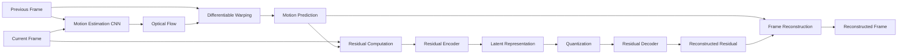

# Neural Video Compression

A PyTorch-based neural video compression prototype built entirely from scratch using learned motion estimation, residual coding, entropy modeling, and rate-distortion optimization.

> **No pretrained models or pretrained weights are used. All neural networks are trained from randomly initialized parameters.**

## Overview

Video contains significant temporal redundancy because consecutive frames often share most of their visual information.

Instead of independently processing every frame, this project learns to:

1. Estimate motion between consecutive frames.
2. Warp the previous frame to predict the current frame.
3. Compute the residual information that remains.
4. Compress the residual using a learned encoder.
5. Quantize the latent representation.
6. Decode the residual using a learned decoder.
7. Reconstruct the current frame.
8. Estimate the bitrate using a learned entropy model.

The project was developed and trained using PyTorch on an NVIDIA Tesla T4 GPU.

---

## System Architecture



---

## How the Model Works

### 1. Motion Estimation

Two consecutive frames are provided to a convolutional neural network:

$$
(F_{t-1}, F_t)
\rightarrow
\text{Motion Network}
\rightarrow
\mathbf{f}_t
$$

where $\mathbf{f}_t$ is a two-channel optical-flow field representing horizontal and vertical pixel displacement.

The motion estimation network is trained completely from scratch.

### 2. Motion Compensation

The predicted optical flow is used to warp the previous frame toward the current frame:

$$
\hat{F}_t^{motion}
=
Warp(F_{t-1}, \mathbf{f}_t)
$$

This produces a motion-based prediction of the current frame.

### 3. Residual Computation

The information that cannot be explained by the motion prediction is represented as a residual:

$$
R_t
=
F_t - \hat{F}_t^{motion}
$$

A good motion prediction should reduce the amount of information remaining in the residual.

### 4. Residual Encoding

The residual is passed through a learned convolutional encoder:

$$
R_t
\xrightarrow{Encoder}
y_t
$$

where $y_t$ is a compact latent representation.

For the current model, the encoder reduces the spatial dimensions by a factor of 8 while increasing the number of latent channels.

### 5. Latent Quantization

The continuous latent representation is converted into discrete values:

$$
\hat{y}_t
=
round(y_t)
$$

During training, a straight-through estimator is used so gradients can still propagate through the quantization operation.

### 6. Residual Decoding

The quantized latent representation is passed through the learned decoder:

$$
\hat{y}_t
\xrightarrow{Decoder}
\hat{R}_t
$$

where $\hat{R}_t$ is the reconstructed residual.

### 7. Frame Reconstruction

The reconstructed frame is obtained by combining the motion prediction with the decoded residual:

$$
\hat{F}_t
=
\hat{F}_t^{motion}
+
\hat{R}_t
$$

The final values are clipped to the valid normalized image range:

$$
\hat{F}_t \in [0,1]
$$

---

## Entropy Modeling

The latent representation should be compact not only in terms of dimensions but also in terms of its estimated coding cost.

This project uses a learned Gaussian probability model for the quantized latent representation.

For a quantized latent value $\hat{y}$:

$$
p(\hat{y})
=
\Phi
\left(
\frac{\hat{y}+0.5}{\sigma}
\right)
-
\Phi
\left(
\frac{\hat{y}-0.5}{\sigma}
\right)
$$

where:

- $\Phi$ is the standard Gaussian cumulative distribution function.
- $\sigma$ is a learned scale parameter.

The estimated number of bits for a latent value is:

$$
R
=
-\log_2 p(\hat{y})
$$

The estimated bitrate is represented using bits per pixel:

$$
BPP
=
\frac{\text{Estimated Total Bits}}
{\text{Number of Image Pixels}}
$$

> **Note:** The current BPP value is a learned bitrate estimate. The implementation does not yet produce a standards-compatible arithmetic-coded neural bitstream.

---

## Rate-Distortion Optimization

The model jointly optimizes reconstruction quality and estimated bitrate.

The objective is:

$$
\mathcal{L}
=
D+\lambda R
$$

For this implementation:

$$
\mathcal{L}
=
MSE+\lambda \cdot BPP
$$

where:

- $MSE$ represents reconstruction distortion.
- $BPP$ represents the estimated bitrate.
- $\lambda$ controls the trade-off between reconstruction quality and compression rate.

A lower distortion improves reconstruction quality, while a lower estimated rate encourages a more compact latent representation.

---

## Training Configuration

| Parameter | Value |
|---|---|
| Framework | PyTorch |
| GPU | NVIDIA Tesla T4 |
| Dataset | Vimeo-90K-derived mini dataset |
| Total sequences | 1,000 |
| Training sequences | 800 |
| Validation sequences | 100 |
| Test sequences | 100 |
| Frames per sequence | 3 |
| Training resolution | 448 × 256 |
| Batch size | 4 |
| Optimizer | Adam |
| Learning rate | $1 \times 10^{-4}$ |
| Weight decay | $1 \times 10^{-5}$ |
| Training epochs | 10 |
| $\lambda$ | 0.01 |

The dataset is split at the **sequence level** so that frames from the same sequence are not shared between training, validation, and test sets.

---

## Dataset

The project uses 1,000 sequences from a Vimeo-90K-derived mini dataset.

Each sequence contains three consecutive RGB frames:

```text
frame_01
frame_02
frame_03
```

The split used in this project is:

```text
Training    : 800 sequences
Validation  : 100 sequences
Testing     : 100 sequences
```

The dataset itself is **not included in this repository**.

---

## Evaluation Metrics

### Mean Squared Error

MSE measures the average squared difference between the original and reconstructed pixels:

$$
MSE
=
\frac{1}{N}
\sum_{i=1}^{N}
(x_i-\hat{x}_i)^2
$$

Lower MSE indicates lower reconstruction error.

### Peak Signal-to-Noise Ratio

PSNR is calculated from the reconstruction error:

$$
PSNR
=
10\log_{10}
\left(
\frac{MAX^2}{MSE}
\right)
$$

For normalized images:

$$
MAX=1
$$

Higher PSNR generally indicates better reconstruction quality.

### Bits Per Pixel

BPP represents the estimated coding rate per image pixel:

$$
BPP
=
\frac{\text{Estimated Bits}}
{\text{Number of Pixels}}
$$

Lower BPP indicates a lower estimated bitrate.

---

## Experimental Results

### Held-Out Test Set

The best model checkpoint was selected using validation loss and then evaluated on the held-out test set.

| Metric | Result |
|---|---:|
| PSNR | **27.92 dB** |
| MSE | **0.001615** |
| Learned BPP | **1.171961** |

These values were obtained from the final test evaluation.

---

## Reconstruction Example

The repository contains a visual comparison between the original and reconstructed frames:


The reconstruction preserves the major structure and appearance of the target frame while showing some smoothing and reconstruction artifacts.

---

## Training Behavior

The training process records:

- Rate-distortion loss
- Reconstruction MSE
- Estimated BPP
- Validation loss
- Validation MSE
- Validation BPP

The complete training history is stored in:

```text
results/training_history.json
```

---

## Real Video Inference

After training, the model was tested on a separate video outside the training dataset.

The video processing pipeline is:

```text
Input Video
     |
     v
Frame Reading
     |
     v
Motion Estimation
     |
     v
Motion Compensation
     |
     v
Residual Computation
     |
     v
Residual Encoder
     |
     v
Latent Quantization
     |
     v
Residual Decoder
     |
     v
Frame Reconstruction
     |
     v
Output Video
```

The model successfully processed approximately **1,691 readable frames** from the test video and generated a reconstructed MP4.

The input video had:

```text
Resolution : 854 × 480
Frame Rate : 24 FPS
```

During neural processing, frames are converted to the model's training resolution of 448 × 256 and then restored to the original video resolution during reconstruction.

---

## Streamlit Application

A Streamlit application is included for interactive inference.

The application:

1. Accepts an uploaded video.
2. Loads the trained neural compression model.
3. Processes frames sequentially.
4. Performs motion estimation.
5. Encodes and decodes residual information.
6. Reconstructs the video.
7. Produces a downloadable reconstructed MP4.

The trained checkpoint used by the application is:

```text
checkpoints/best_model.pth
```

The Streamlit source files are:

```text
app/
├── app.py
└── neural_codec.py
```

---

## Project Structure

```text
Neural-Video-Compression/
│
├── app/
│   ├── app.py
│   └── neural_codec.py
│
├── checkpoints/
│   └── best_model.pth
│
├── notebooks/
│   └── Neural_Video_Compression.ipynb
│
├── results/
│   ├── final_test_results.json
│   ├── real_video_evaluation.json
│   ├── test_reconstruction_comparison.png
│   └── training_history.json
│
├── .gitignore
├── README.md
└── requirements.txt
```

---

## Reproducibility

The complete experiment and development process is documented in:

```text
notebooks/Neural_Video_Compression.ipynb
```

The trained model is available at:

```text
checkpoints/best_model.pth
```

The required Python packages are listed in:

```text
requirements.txt
```

The dataset is not included in the repository and must be obtained separately.

---

## Limitations

This project is an academic and research prototype rather than a production video codec.

Current limitations include:

- The entropy model provides a learned bitrate estimate rather than a complete arithmetic-coded bitstream.
- The neural model operates internally at a fixed resolution of 448 × 256.
- Reconstruction can introduce smoothing and visual artifacts.
- The current implementation prioritizes demonstrating the principles of learned video compression rather than real-time performance.
- The current video inference pipeline does not yet implement full neural bitstream generation.

---

## Future Work

Possible improvements include:

- Improved motion estimation architectures
- More expressive entropy models
- Multi-scale video processing
- Perceptual losses such as SSIM or LPIPS
- Better rate-distortion control
- Actual entropy coding and neural bitstream generation
- Improved temporal modeling using longer frame sequences
- Faster GPU inference
- Audio preservation and complete multimedia reconstruction
- Deployment optimization for real-time applications

---

## Technologies

- Python
- PyTorch
- Torchvision
- OpenCV
- NumPy
- Pillow
- FFmpeg
- Streamlit
- Google Colab

---

## Author

**Munna Kumar Sah**

GitHub: [@doitmuna](https://github.com/doitmuna)

---

## License

This project is intended for academic and educational use.