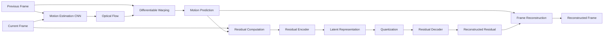
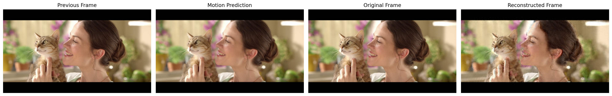

## Live Demo

[](https://neural-video-compression-doitmuna.streamlit.app/)

Try the trained neural video compression model directly in your browser.
# Neural Video Compression

A PyTorch-based neural video compression prototype built entirely from scratch using learned motion estimation, residual coding, entropy modeling, and rate-distortion optimization.

> **No pretrained models or pretrained weights are used. All neural networks are trained from randomly initialized parameters.**

---

## Overview

Video contains significant **temporal redundancy** because consecutive frames often contain very similar visual information.

Instead of processing every frame independently, this project learns to use the previous frame to predict the current frame and then encode only the information that cannot be predicted.

The complete pipeline is:

```text
Previous Frame + Current Frame
            │
            ▼
   Motion Estimation CNN
            │
            ▼
      Optical Flow
            │
            ▼
  Differentiable Warping
            │
            ▼
    Motion Prediction
            │
            ▼
      Residual Frame
            │
            ▼
    Residual Encoder
            │
            ▼
   Latent Representation
            │
            ▼
       Quantization
            │
            ▼
    Residual Decoder
            │
            ▼
  Reconstructed Residual
            │
            ▼
   Reconstructed Frame
```

---

## Key Features

- CNN-based motion estimation
- Differentiable optical-flow warping
- Residual-based frame prediction
- Learned convolutional residual encoder
- Learned convolutional residual decoder
- Latent quantization
- Learned Gaussian entropy model
- Rate-distortion optimization
- PSNR, MSE, and BPP evaluation
- Video-level inference
- Streamlit interface for demonstration

---

## System Architecture



---

# How the Model Works

## 1. Motion Estimation

Two consecutive RGB frames are provided to a convolutional neural network:

```text
Previous Frame ──┐
                 ├──> Motion Estimation CNN ──> Optical Flow
Current Frame  ──┘
```

The network predicts a **2-channel optical-flow field**:

```text
Channel 1 → horizontal displacement
Channel 2 → vertical displacement
```

The network is trained entirely from scratch.

---

## 2. Motion Compensation

The predicted optical flow is used to warp the previous frame toward the current frame:

```text
Motion Prediction = Warp(Previous Frame, Optical Flow)
```

The goal is to generate a good prediction of the current frame using information that already exists in the previous frame.

---

## 3. Residual Computation

The information that cannot be explained by the motion prediction is represented as a residual:

```text
Residual = Current Frame − Motion Prediction
```

In mathematical notation:

```text
Rₜ = Fₜ − F̂ₜᵐᵒᵗⁱᵒⁿ
```

A better motion prediction produces a smaller residual.

---

## 4. Residual Encoding

The residual is passed through a learned convolutional encoder:

```text
Residual
    │
    ▼
Residual Encoder
    │
    ▼
Latent Representation
```

For the current model, the spatial resolution is reduced by a factor of 8:

```text
Input residual : 3 × 256 × 448
Latent         : 64 × 32 × 56
```

The latent representation contains a compact representation of the residual information.

---

## 5. Latent Quantization

The continuous latent representation is converted into discrete values:

```text
ŷₜ = round(yₜ)
```

Quantization is important because a practical compression system requires discrete values that can be represented and encoded.

During training, a **straight-through estimator** is used so the model can still receive gradients through the quantization step.

---

## 6. Residual Decoding

The quantized latent representation is passed through the learned decoder:

```text
Quantized Latent
       │
       ▼
Residual Decoder
       │
       ▼
Reconstructed Residual
```

The decoder attempts to recover the original residual information.

---

## 7. Frame Reconstruction

The final frame is reconstructed using:

```text
Reconstructed Frame
=
Motion Prediction
+
Reconstructed Residual
```

or:

```text
F̂ₜ = F̂ₜᵐᵒᵗⁱᵒⁿ + R̂ₜ
```

The reconstructed values are clipped to the valid normalized image range `[0, 1]`.

---

# Entropy Modeling

A compact latent representation is not enough. We also need an estimate of how efficiently the latent values can be encoded.

This project uses a **learned Gaussian probability model**.

For a quantized latent value `ŷ`, the probability mass is estimated from a Gaussian distribution:

```text
p(ŷ)
=
Φ((ŷ + 0.5) / σ)
−
Φ((ŷ − 0.5) / σ)
```

where:

```text
Φ = standard Gaussian cumulative distribution function
σ = learned scale parameter
```

The estimated coding cost is:

```text
Bits = −log₂(p(ŷ))
```

The estimated bitrate is represented using **Bits Per Pixel (BPP)**:

```text
BPP
=
Estimated Total Bits
--------------------
Number of Image Pixels
```

> **Important:** The current implementation uses a learned bitrate estimate. It does not yet generate a complete arithmetic-coded neural bitstream.

---

# Rate-Distortion Optimization

The model must balance two objectives:

```text
1. Reconstruction quality
2. Compression rate
```

The training objective is:

```text
L = D + λR
```

For this implementation:

```text
L = MSE + λ × BPP
```

where:

```text
MSE → reconstruction distortion
BPP → learned bitrate estimate
λ   → rate-distortion trade-off parameter
```

A lower MSE improves reconstruction quality, while a lower BPP encourages a more compact representation.

---

# Training Configuration

| Parameter | Value |
|---|---|
| Framework | PyTorch |
| GPU | NVIDIA Tesla T4 |
| Dataset | Vimeo-90K-derived mini dataset |
| Total sequences | 1,000 |
| Training sequences | 800 |
| Validation sequences | 100 |
| Test sequences | 100 |
| Frames per sequence | 3 |
| Training resolution | 448 × 256 |
| Batch size | 4 |
| Optimizer | Adam |
| Learning rate | 1 × 10⁻⁴ |
| Weight decay | 1 × 10⁻⁵ |
| Training epochs | 10 |
| λ | 0.01 |

The dataset is split at the **sequence level**, preventing frames from the same sequence from appearing across training, validation, and test sets.

---

# Dataset

A subset of **1,000 video sequences** was used for this project.

```text
Training    → 800 sequences
Validation  → 100 sequences
Testing     → 100 sequences
```

Each sequence contains three consecutive RGB frames:

```text
frame_01.png
frame_02.png
frame_03.png
```

The dataset itself is **not included in the repository**.

---

# Evaluation Metrics

## Mean Squared Error (MSE)

MSE measures the average squared pixel-level reconstruction error:

```text
MSE
=
1/N × Σ(xᵢ − x̂ᵢ)²
```

Lower MSE indicates lower reconstruction error.

---

## Peak Signal-to-Noise Ratio (PSNR)

PSNR is calculated from MSE:

```text
PSNR
=
10 × log₁₀(MAX² / MSE)
```

For normalized images:

```text
MAX = 1
```

Higher PSNR generally indicates better reconstruction quality.

---

## Bits Per Pixel (BPP)

BPP represents the estimated coding rate:

```text
BPP
=
Estimated Bits / Number of Pixels
```

Lower BPP represents a lower estimated bitrate.

---

# Experimental Results

The best model was selected using validation loss and then evaluated on the held-out test set.

## Test Set Results

| Metric | Result |
|---|---:|
| PSNR | **27.92 dB** |
| MSE | **0.001615** |
| Learned BPP | **1.171961** |

These values were obtained from the final test evaluation.

---

# Reconstruction Example

The following image shows a reconstruction produced by the trained model:



The reconstruction preserves the major structure and appearance of the target frame while showing some smoothing and reconstruction artifacts.

---

# Training Behavior

The training process records:

- Training loss
- Training MSE
- Training BPP
- Validation loss
- Validation MSE
- Validation BPP

The recorded training history is stored in:

```text
results/training_history.json
```

This can be used to reproduce training curves and analyze the rate-distortion behavior of the model.

---

# Real Video Inference

After training, the model was tested on a separate video outside the training dataset.

The inference pipeline is:

```text
Input Video
     │
     ▼
Read Video Frames
     │
     ▼
Motion Estimation
     │
     ▼
Motion Compensation
     │
     ▼
Residual Computation
     │
     ▼
Residual Encoding
     │
     ▼
Latent Quantization
     │
     ▼
Residual Decoding
     │
     ▼
Frame Reconstruction
     │
     ▼
Output Video
```

The trained model successfully processed approximately **1,691 readable frames** from the external test video.

Input video properties:

```text
Resolution : 854 × 480
Frame Rate : 24 FPS
```

The neural model operates internally at:

```text
448 × 256
```

and reconstructed frames are restored to the original video resolution during inference.

---

# Streamlit Application

A Streamlit application is included for interactive demonstration.

The application:

1. Accepts a video upload.
2. Loads the trained model checkpoint.
3. Processes frames sequentially.
4. Estimates motion between consecutive frames.
5. Reconstructs each frame using the learned residual representation.
6. Produces a reconstructed MP4 video.
7. Provides the output for download.

The deployment files are:

```text
app/
├── app.py
└── neural_codec.py
```

The trained checkpoint is:

```text
checkpoints/best_model.pth
```

> The Streamlit application performs inference only. It does not train the model.

---

# Project Structure

```text
Neural-Video-Compression/
│
├── app/
│   ├── app.py
│   └── neural_codec.py
│
├── checkpoints/
│   └── best_model.pth
│
├── notebooks/
│   └── Neural_Video_Compression.ipynb
│
├── results/
│   ├── final_test_results.json
│   ├── real_video_evaluation.json
│   ├── test_reconstruction_comparison.png
│   └── training_history.json
│
├── .gitignore
├── README.md
└── requirements.txt
```

---

# Reproducibility

The complete experiment and development process is documented in:

```text
notebooks/Neural_Video_Compression.ipynb
```

The trained model is stored in:

```text
checkpoints/best_model.pth
```

The required Python packages are listed in:

```text
requirements.txt
```

The dataset is not included in the repository and must be obtained separately.

---

# Limitations

This project is an academic and research prototype rather than a production video codec.

Current limitations include:

- The entropy model provides a learned bitrate estimate rather than a complete arithmetic-coded bitstream.
- The neural model operates internally at a fixed resolution of 448 × 256.
- Reconstruction can introduce smoothing and visual artifacts.
- The current implementation is designed primarily to demonstrate the principles of learned video compression rather than real-time performance.
- The current system does not implement complete neural bitstream generation.
- The current video pipeline does not yet preserve the original audio track.

---

# Future Work

Possible extensions include:

- Improved motion estimation architectures
- More expressive entropy models
- Longer temporal context using additional frames
- Multi-scale video processing
- Perceptual losses such as SSIM or LPIPS
- Better rate-distortion control
- Actual arithmetic entropy coding
- Complete neural bitstream generation
- Audio preservation
- Faster GPU inference
- Real-time deployment optimization

---

# Technologies

```text
Python
PyTorch
Torchvision
OpenCV
NumPy
Pillow
FFmpeg
Streamlit
Google Colab
```

---

# Author

**Munna Kumar Sah**

GitHub: [@doitmuna](https://github.com/doitmuna)

---

# License

This project is intended for academic and educational use.
